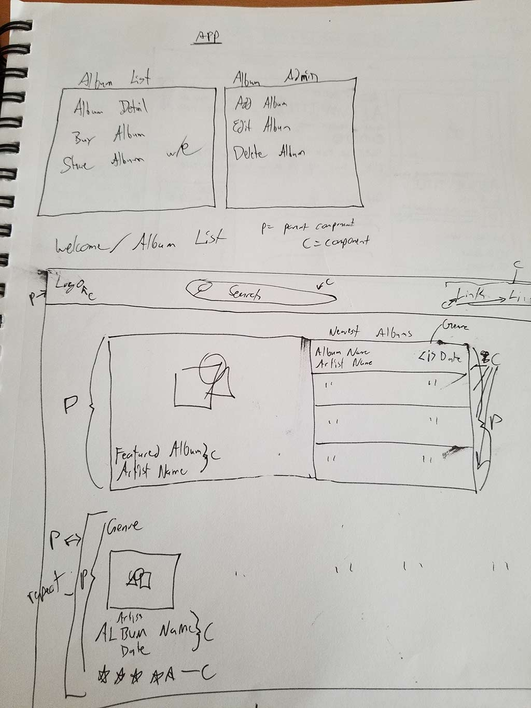

#Savage Sound - An Album Review Site

This project was built with [React](https://reactjs.org/) v15.5.4.

## Created by Dan Mace

## Description

Savage Sound is an album review site concept focusing on niche music groups that may qualify as 'savage', with a large focus on independent label rock groups.  Despite a large amount of content being produced regularly within this music scene, there doesn't exist an authority that attempts to cover the releases for these genres.

### Concept

As I brainstormed for this project, I wanted to implement features and components that would serve the user, the band, and the label.  I wanted to bring in a sidebar interface that mimicked the experience provided by BandCamp and I wanted to provide resources that best directly funds the bands.  This would include the ability to listen to the band with an embed from BandCamp while reading the review, and provide links to purchase through BandCamp and other popular digital outlets like iTunes, Amazon and Spotify.

It'd be nice to funnel people into paying for the music through BandCamp, but the convenience provided by apps like Spotify and iTunes for playing the music on any device now trumps the format provided from direct digital downloads.  Rather than coercing a user into the sales funnel I want them in, I should allow the user to make the decisions they want to make and find another way to have a user spend money on the group directly.

So, with that, a goal for this project will be to integrate it with APIs and show the selected band's published tour events, perhaps using a user's IP address to highlight the closest one to their location in the list of locations for the tour.

### UI/UX

The user visits the site and is greeted with the featured album and a list of most recent albums.  Below, a user can view recent albums by more specific genre types.  Clicking on any album brings you to the Album Review page for that album.  The album review page shows all data for the album, cover image, player for the album and links to purchases.

The Album Page shows author score, user score and maybe metacritic score if API available.  A user can submit a user score to affect a change in the user score figure.

### React Components and State

All components provide album information from a data source and are generated from that information.  The Album Review page is a template for the data passed down from the App.  In theory, you'd store the whole review in a cell/key in a database with the album information in other keys.

An admin for this would be the next stretch goal, a backend dash for submitting a new album and a review for it, and pushing that into the state data.

### Sketches





## Setup Instructions

Clone or download repository.

``` npm i ``` to install packages and dependencies.

``` webpack ``` to build

``` webpack-dev-server --open ``` to open in browser on localhost:8000

## Known Bugs

AlbumReview component crashes on refresh as the initial state of selectedAlbum is set to null.

## Development Goals

 - Add more front page components for featuring album content
 - Add links to stores for Album Review Page
 - Add social API integration for sharing the page (need to fix loading selectedAlbum by URL)
 - Add user ratings interaction with state
